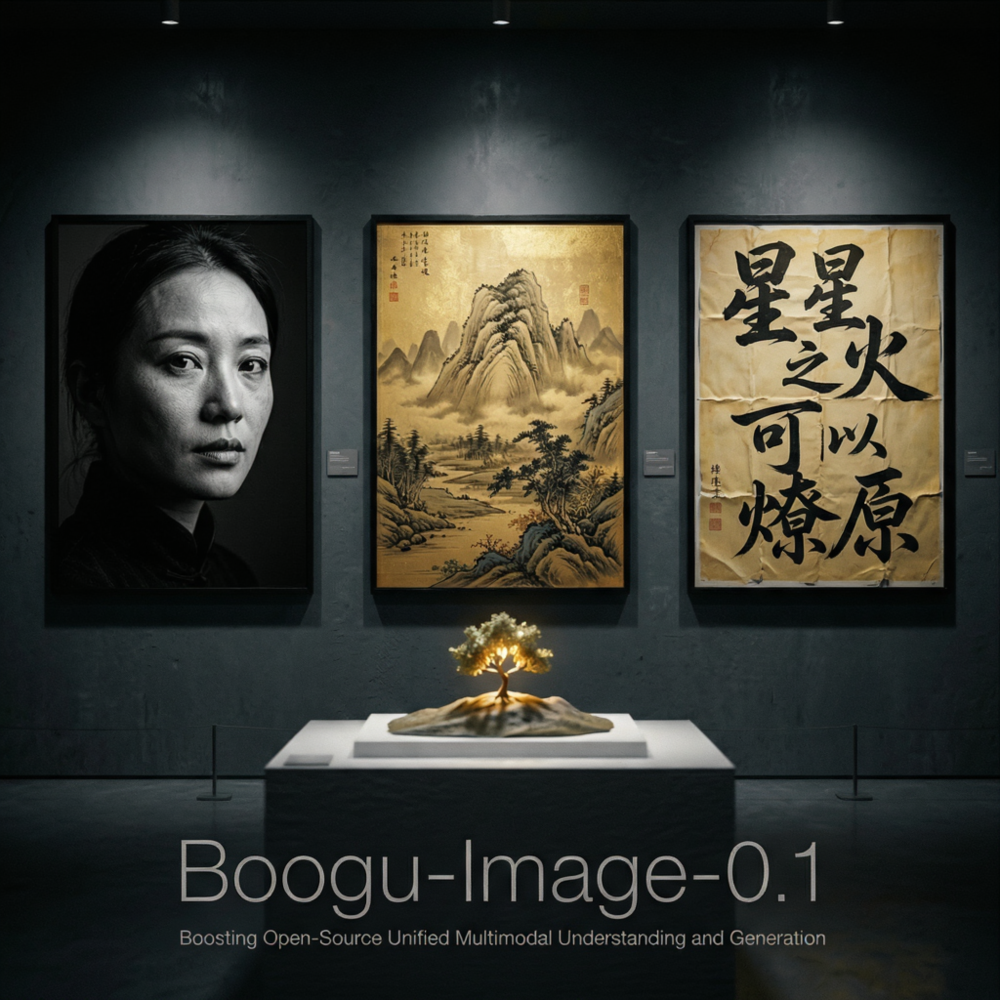
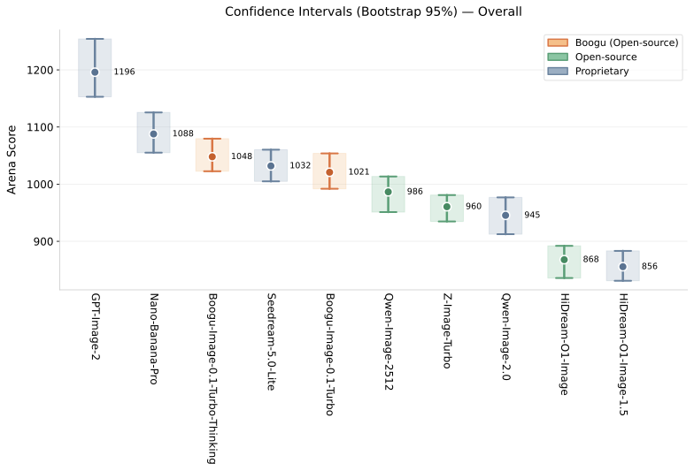

<p align="center">
  
</p>

<h3 align="center">Boosting Open-Source Unified Multimodal Understanding and Generation</h3>

<div align="center">




<!-- ============== Badges ============== -->
<!-- [](https://arxiv.org/abs/{{ paper_id }}) -->
[](https://boogu.org)
[](https://huggingface.co/Boogu)
[](https://github.com/boogu-project/Boogu-Image)
[](https://modelscope.cn/organization/Boogu)
[](https://boogu-gallery.netlify.app/)

[](http://demo-base.boogu.org/)
[](http://demo-edit.boogu.org/)
[](http://demo-turbo.boogu.org/)
[](LICENSE)
[-lightgrey)]()

Welcome to the official repository for **Boogu-Image-0.1** !

English | [中文](./README_CN.md)

</div>

---

## 📖 Introduction

**Boogu-Image-0.1** is a competitive **Apache-2.0 open-source unified image generation and editing model family**, including **Base**, **Turbo**, **Edit**, and other variants that provide stable, practical capabilities for high-quality text-to-image generation, fast generation, image editing, and Chinese-English text rendering. Closed-source multimodal understanding and generation systems like Nano Banana Pro and GPT-Image-2 achieve remarkable performance not because of a single model, but through a highly unified suite of system capabilities. However, under training compute that is extremely limited compared with closed-source systems, we find that systematically improving a model's understanding ability, data quality, and training pipeline can still significantly improve image generation and editing performance. Specifically, compared with some existing open-source models, our training data scale is roughly one order of magnitude smaller. We hope our empirical study and open-source release will help advance the open-source ecosystem for multimodal generation and understanding.

This repository provides checkpoints and inference code for **Boogu-Image-0.1**.

## 🏆 Boogu Arena

Since we could not evaluate on LM Arena directly, we built **Boogu Arena**, an LM Arena-style preference evaluation. We use an LLM to generate diverse user personas, then ask each persona to produce image generation prompts, resulting in **1K+ test prompts** that we will release publicly for community reproduction. The ELO leaderboard below spans leading closed- and open-source systems. **We welcome teams with questions about the results to contact us so that we can work toward a more objective, fair, and reproducible evaluation.**

<!-- <p align="center">
  
</p> -->
<p align="center">
  
</p>

## ✨ Highlights

- 📸 **Beautiful and Precise Photography** — Accurately understands photography prompts and generates high-quality images with natural lighting, coherent composition, and faithful details, preserving coherent subject, background, and spatial relationships even in complex real-world scenes

- 📝 **Diverse and Stable Text Rendering** — Supports a wide range of text-heavy designs — posters, stamps, documents, interfaces, brand guides, and handwritten boards — with readable structure, stable typography, and robust bilingual (Chinese/English) rendering across diverse layouts
- 🎨 **Diverse and Beautiful Stylization** — Handles stylized generation across miniature 3D scenes, Chinese-inspired gilded aesthetics, shining fantasy visuals, anime portraits, and mythic character art — not just style transfer, but stable, attractive, and prompt-aware creative generation
- 📊 **Competitive General Performance** — Demonstrates competitive performance across many scenarios and benchmarks, with the Boogu-Image-0.1 family ranking among the very top of evaluated open- and closed-source systems in Boogu Arena

> 📖 For the full set of practical lessons and an honest account of current limitations, see [Responsible AI & Limitations](#-responsible-ai--limitations) below.

## 📣 News
- **2026-06-XX** 🧊 **Boogu-Image-0.1-Edit-Turbo (Image-to-Image) is coming!**
- **2026-06-XX** 🧊 **Boogu-Image-0.1-Turbo-2K (Text-to-Image) is coming!** 
- **2026-06-17** 🔥 [**ComfyUI-Boogu**](https://huggingface.co/Comfy-Org/Boogu-Image) powered by ComfyUI is released! Thank you, ComfyUI!
- **2026-06-17** 🔥 [**ComfyUI-Boogu**](https://github.com/boogu-project/ComfyUI-Boogu) is released! 
- **2026-06-16** 🔥 **Boogu-Image-0.1-Base (Text-to-Image) is released!** The core text-to-image foundation model. Try the [online demo](http://demo-base.boogu.org/).
- **2026-06-16** 🎨 **Boogu-Image-0.1-Edit (Image-to-Image) is released!** Image editing and transformation capabilities now available. Try the [online demo](http://demo-edit.boogu.org/). **Only support 1 reference image for now. Will try our best to support more reference images. Stay tuned!**
- **2026-06-16** 🚀 **Boogu-Image-0.1-Turbo is released!** Four-step distilled variant for fast inference and photorealistic generation. Try the [online demo](http://demo-turbo.boogu.org/).
<!-- - **[{{ 2026-06-DD }}]** 📄 **Technical report is released!** Read our findings on [arXiv](https://arxiv.org/abs/{{ paper_id }}). -->

## 📥 Model Zoo


| Model | Params | Training | Steps | CFG | Task | Hugging Face | ModelScope | Demo |
| :--- | :---: | :---: | :---: | :---: | :---: | :---: | :---: | :---: |
| **Boogu-Image-0.1-Base** | 10B | Joint Training | 25~50 | 2.0～5.0<br>（e.g., 4.0） | T2I | [](https://huggingface.co/Boogu/Boogu-Image-0.1-Base) | [](https://modelscope.cn/models/Boogu/Boogu-Image-0.1-Base) | [](http://demo-base.boogu.org/) |
| **Boogu-Image-0.1-Base-fp8** | 10B | Joint Training | 25~50 | 2.0～5.0<br>（e.g., 4.0） | T2I | [](https://huggingface.co/Boogu/Boogu-Image-0.1-Base-fp8) | [](https://modelscope.cn/models/Boogu/Boogu-Image-0.1-Base-fp8) | — |
| **Boogu-Image-0.1-Edit** | 10B | Joint Training | 25~50 | 2.0～5.0<br>（e.g., 5.0） | TI2I | [](https://huggingface.co/Boogu/Boogu-Image-0.1-Edit) | [](https://modelscope.cn/models/Boogu/Boogu-Image-0.1-Edit) | [](http://demo-edit.boogu.org/) |
| **Boogu-Image-0.1-Edit-fp8** | 10B | Joint Training | 25~50 | 2.0～5.0<br>（e.g., 5.0） | TI2I | [](https://huggingface.co/Boogu/Boogu-Image-0.1-Edit-fp8) | [](https://modelscope.cn/models/Boogu/Boogu-Image-0.1-Edit-fp8) | — |
| **Boogu-Image-0.1-Turbo** | 10B | + Decoupled DMD | 4 | 0.0 | T2I | [](https://huggingface.co/Boogu/Boogu-Image-0.1-Turbo) | [](https://modelscope.cn/models/Boogu/Boogu-Image-0.1-Turbo) | [](http://demo-turbo.boogu.org/) |
| **Boogu-Image-0.1-Turbo-fp8** | 10B | + Decoupled DMD | 4 | 0.0 | T2I | [](https://huggingface.co/Boogu/Boogu-Image-0.1-Turbo-fp8) | [](https://modelscope.cn/models/Boogu/Boogu-Image-0.1-Turbo-fp8) | — |

- **Boogu-Image-0.1-Base**: Foundation model with strong **diversity** and **controllability** — ideal for **fine-tuning** and downstream development. Mainly intended for **ultra-dense text rendering**; for photorealism, Turbo is usually the better default.
- **Boogu-Image-0.1-Edit**: Image editing and transformation variant.
- **Boogu-Image-0.1-Turbo**: Distilled variant with the **same parameter count**, typically requiring only **3~4 steps**. Focuses on **high-quality generation** and photorealism while preserving bilingual text rendering and prompt adherence.


## 🛠️ Installation

> **Tested environment:** Python 3.10 · CUDA 12.6 · PyTorch 2.7.1

```bash
# Use a brand new conda environment
conda create -y -n boogu python=3.10
conda activate boogu
# Instal necessary dependencies
# PyTorch up to 2.11.0 with CUDA up to 12.8 is supported
# Check `requirements/<torch>_<cuda>.txt`
pip install -r requirements/torch2.7-cu126.txt
pip install -e .
python utils/get_flash_attn.py
```

or

```bash
bash quick_start.sh
conda activate boogu
```

### Download Checkpoints
Download the model weights into a local `models/` directory before running inference. We recommend using the official Hugging Face CLI:

```bash
pip install -U "huggingface_hub[cli]"

# Download to ./models/<model-name>
huggingface-cli download Boogu/Boogu-Image-0.1-Base --local-dir models/Boogu-Image-0.1-Base
huggingface-cli download Boogu/Boogu-Image-0.1-Turbo --local-dir models/Boogu-Image-0.1-Turbo
huggingface-cli download Boogu/Boogu-Image-0.1-Edit --local-dir models/Boogu-Image-0.1-Edit
```


Example layout after download:
```
models/
└── Boogu-Image-0.1-Base/
    ├── model_index.json
    ├── mllm
    ├── processor
    ├── scheduler
    ├── transformer
    └── vae
```

Then point inference to the local path via `--model models/Boogu-Image-0.1-Base`.

### Flash Attention

This repository provides `utils/get_flash_attn.py` to automatically install a compatible `flash-attn` wheel for your environment.

Requirements:
- Python and PyTorch with CUDA already installed
- Linux x86_64

```bash
# Auto: detect environment, download a prebuilt wheel, fallback to source build
python utils/get_flash_attn.py

# Force source compilation
python utils/get_flash_attn.py --build
```

The script first searches [`mjun0812/flash-attention-prebuild-wheels`](https://github.com/mjun0812/flash-attention-prebuild-wheels), then tries official [`Dao-AILab/flash-attention`](https://github.com/Dao-AILab/flash-attention) release wheels with both cxx11abi variants, and finally falls back to source compilation via `pip install flash-attn --no-build-isolation`.


## 🚀 Quick Start

### PyTorch Native T2I Inference

```bash
export device="cuda:0" # Required

# Prompt enhancement is powered by an instruction reasoner, also called the rewriter.
# We provide two ways to use it:
#
# 1. Standalone external rewriter:
#    See utils/t2i_external_prompt_rewriter.py. This is a pure external mode example and
#    requires enough GPU memory, without advanced memory management.
#    python utils/t2i_external_prompt_rewriter.py --prompt "draw a cat" --model /path/to/Qwen3-VL-32B-Instruct --lang en
#
# 2. Pipeline-integrated rewriter:
#    See the scripts under `demo_scripts` whose names contain "reasoning".
#    For example: demo_scripts/demo_t2i_local_reasoning.sh
#    This mode supports more flexible memory management. Set the generation and
#    rewriter devices manually, then pass them to inference.py:
#    export device="cuda:0"
#    export rewriter_device="cuda:1"
#    python inference.py --device $device --rewriter_device $rewriter_device ...
#    For more details, see INFERENCE_GUIDE.md.

python inference.py \
  --pretrained_pipeline_name_or_path "models/Boogu-Image-0.1-Base" \
  --instruction "一幅国风琉金风格的山水画作，展现了桂林山水在金光普照下的壮丽景象。远山层叠，江水如镜，山峰边缘勾勒着发光的金色线条。画面采用石青石绿岩彩与鎏金质感相结合，局部有厚涂油画笔触，空中飘浮着金色粒子，营造出梦幻朦胧而又磅礴大气的意境。" \
  --num_inference_steps 50 \
  --height 1024 --width 1024 \
  --text_guidance_scale 4.0 \
  --output_image_path "outputs/test_base/out_1.png" \
  --device "$device"
```

### Hardware Notes

> 📖 For full CLI options, device setup, offload strategies, caching acceleration, Torch Compile, FP8, and batch inference details, see [**INFERENCE_GUIDE.md**](./INFERENCE_GUIDE.md).
> Torch Compile note: `--enable_torch_compile` can occasionally produce all-black outputs on some GPUs/models. If that happens, disable it first.

| VRAM | Recommended Config (T2I 1K)                                                                                           | Recommended Config (T2I 2K)                                                                                           |
|------|-----------------------------------------------------------------------------------------------------------------------|-----------------------------------------------------------------------------------------------------------------------|
| 12GB | Unquantized: `--enable_sequential_cpu_offload_flag`<br>Quantized: `--enable_model_cpu_offload_flag --use_fp8_weights` | Unquantized: `--enable_sequential_cpu_offload_flag`<br>Quantized: `--enable_group_offload_flag --use_fp8_weights`     |
| 16GB | Unquantized: `--enable_sequential_cpu_offload_flag`<br>Quantized: `--enable_model_cpu_offload_flag --use_fp8_weights` | Unquantized: `--enable_sequential_cpu_offload_flag`<br>Quantized: `--enable_model_cpu_offload_flag --use_fp8_weights` |
| 24GB | Unquantized: `--enable_model_cpu_offload_flag`<br>Quantized `--use_fp8_weights`                                       | `--enable_model_cpu_offload_flag`                                                                                     |
| 32GB | Unquantized: `--enable_model_cpu_offload_flag`<br>Quantized: `--use_fp8_weights`                                      | Unquantized: `--enable_model_cpu_offload_flag`<br>Quantized: `--use_fp8_weights`                                      |
| 40GB | Base Model                                                                                                            | Unquantized: `--enable_model_cpu_offload_flag`<br>Quantized: `--use_fp8_weights`                                      |
| 80GB | Base Model                                                                                                            | Base Model                                                                                                            |

## ⚠️ Responsible AI & Limitations

**Boogu-Image-0.1** is released for **research purposes** and is not intended for production deployment without additional safeguards. We took responsible-AI considerations into account during data curation, training, and evaluation; however the model may still produce outputs that are inaccurate, biased, or otherwise inappropriate.

### Known Limitations

**🌍 World Knowledge Gap**
- For tasks requiring rich common sense, domain knowledge, real brands or people, famous landmarks, celebrities, products, or complex contextual understanding, Boogu still has a clear gap from strong closed-source systems
- This capability is extraordinarily expensive to measure; even Arena-style evaluation struggles to assess it fully, so existing benchmarks barely quantify this dimension and the real gap is likely larger than measured scores suggest

**🖼️ Image-to-Image Consistency & In-Context Scenarios**
- For editing tasks requiring strict preservation of the input subject, identity, layout, or fine details, Boogu's image-to-image consistency is still not stable enough
- Because our image-to-image capability focuses more on photography and text-generation applications, Boogu still trails **Seedream 5.0** and **Nano Banana Pro** in some in-context generation scenarios

**📝 Text Rendering Stability**
- Boogu can handle many Chinese and English text scenarios, but long text, dense typography, small fonts, and complex design layouts can still produce typos, missing characters, or layout drift
- Text rendering is currently focused on Chinese and English; other languages are not specifically optimized and may degrade noticeably

**🦴 Body Structure in Complex Poses**
- In multi-person interaction, occlusion, exaggerated motion, or unusual viewpoints, hands, limbs, and body structure may still become unnatural or inconsistent

**👤 Small Faces & Small Limbs**
- Because we use the open-source **FLUX.1 VAE**, reconstruction loss is relatively large, so details such as small faces, small limbs, eyes, and text may still show artifacts or instability

**📦 Limited Release Scope**
- Due to resource constraints, engineering complexity, and release boundaries, we are not able to open-source every training and system detail
- The current open-source release aims to balance reproducibility, usability, and sustainable maintenance while providing a reliable starting point for community research and improvement

Downstream users are responsible for applying content moderation, validation, and compliance checks appropriate to their use case.


## 🙏 Acknowledgements

Closed-source systems such as [GPT-Image](https://openai.com/index/introducing-chatgpt-images-2-0/), [Nano Banana](https://gemini.google/overview/image-generation/), and the [Seedream](https://seed.bytedance.com/en/seedream5_0_lite) series helped us understand the frontier capabilities and practical boundaries of unified understanding-and-generation systems. We thank the [Qwen-Image](https://github.com/QwenLM/Qwen-Image), [Z-Image](https://github.com/Tongyi-MAI/Z-Image), [OmniGen2](https://github.com/VectorSpaceLab/OmniGen2), [FLUX](https://github.com/black-forest-labs/flux), and broader open-source communities for the foundations they provide, and [DeepSeek](https://www.deepseek.com) for strong open-source understanding models that support open-source unified multimodal systems.


## 📄 License

This project is released under the [Apache-2.0 License](LICENSE).
